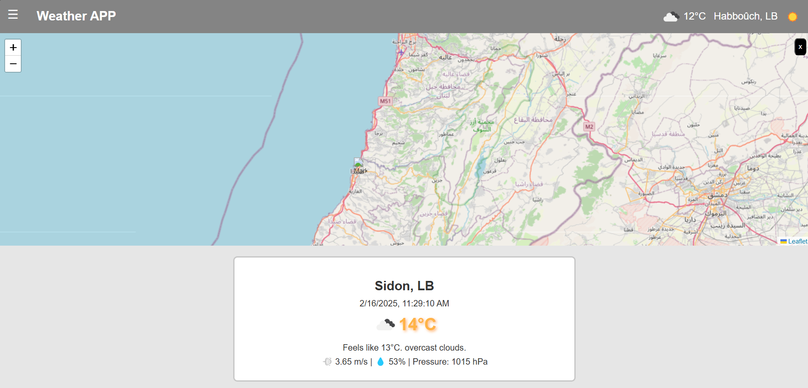
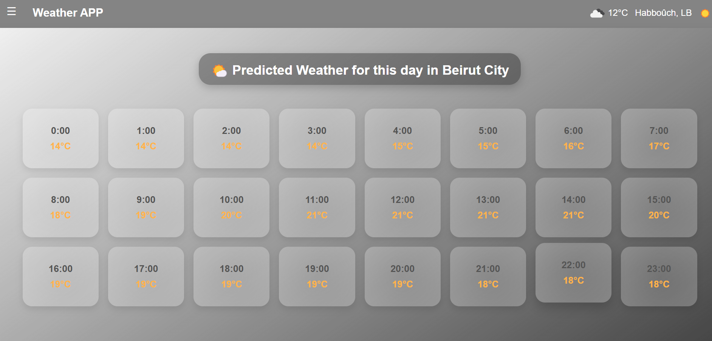
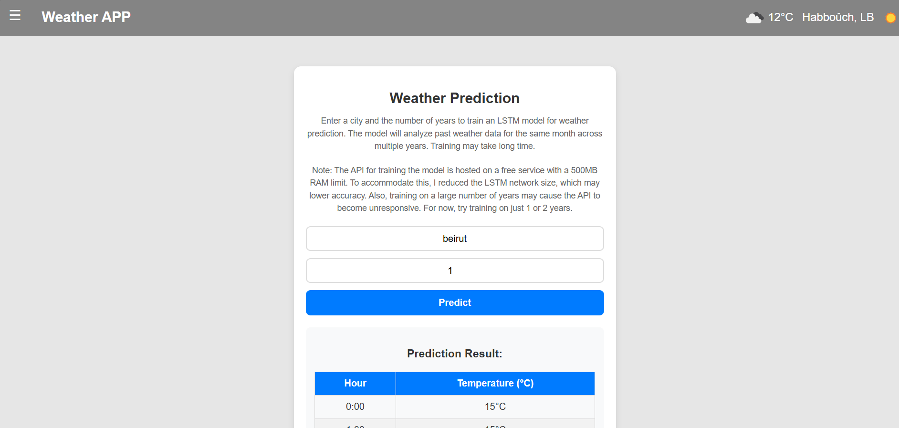

# Weather Prediction App with React and Multiple APIs

This is a React-based weather prediction web application that integrates multiple APIs to provide current weather data, city-specific weather predictions, and customizable weather forecasting for any city using an LSTM model.

## Features
- **Tab 1:** Calls a .NET API that fetches current weather data from the OpenWeather API.
- **Tab 2:** Calls a FastAPI backend with a pre-trained LSTM model (trained on 15 years of Beirut weather data) to predict today's weather.
- **Tab 3:** Calls another FastAPI service that trains an LSTM model on-the-fly to predict weather for any city based on historical data.
- **mode :** day and night mode based on ur current location.

## Technologies Used
- **Frontend:** React.js
- **Backend Services:**
  - .NET API (for OpenWeather API integration)
  - FastAPI (for Beirut weather LSTM prediction)
  - FastAPI (for custom city weather prediction with LSTM training)
  - Django (backend and jwt auth)
- **Machine Learning:** TensorFlow (LSTM implementation)
- **Data Source:**
      OpenWeather API to get current weather
      archive-api.open-meteo.com to get historical data to train the LSTM model
      api.weatherapi.com to get yesterday weather

## Usage
- **Tab 1:** Displays the current weather fetched via the .NET API.
- **Tab 2:** Shows today's predicted weather for Beirut based on the pre-trained LSTM model.
- **Tab 3:** Allows users to select any city and train an LSTM model on-the-fly for weather prediction.
- **Tab 4:** log-in ,Register

## Screenshots
### Home Screen

### Current Weather (map)

### Beirut Weather Prediction (Tab 2)

### Any City Weather Prediction (Tab 3)

## Contact
For any issues or suggestions, feel free to reach out to **Hussein Jouni** husseinjouni62@gmail.com or open an issue in the repository.
